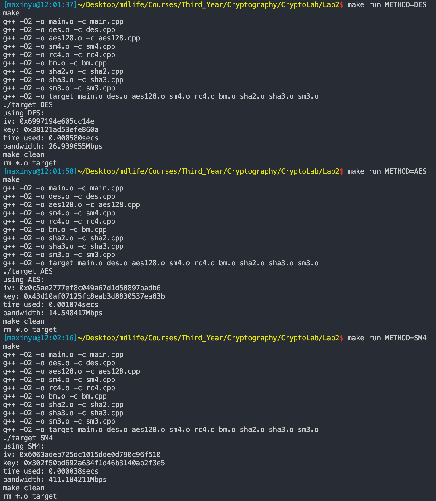

# Lab2 Report

## 实验内容 

1. 编程实现DES、AES-128、SM4三个算法的加解密运算。使用CBC模式，加密一段16K的明文(随机产生)。密钥、IV随机生成。
2. 编程实现RC4算法，生成16K的密钥流。初始密钥（128字节）
3. 使用B-M算法，生成一段序列最短LFSR(生成10个比特长度的序列)
4. 编码实现SHA-2、SM3、SHA-3算法，压缩16K左右的随机数据

## 实验结果

使用C++实现了以上算法（注：SHA2与SHA3只实现了256的版本），`make run`即可运行，修改变量`$(METHOD)`可以选择不同的算法，默认位DES算法，例如：

``` shell
[maxinyu@16:29:16]path/to/CryptoLab/Lab2$ make run METHOD=AES
make
g++ -O2 -o main.o -c main.cpp
g++ -O2 -o des.o -c des.cpp
g++ -O2 -o aes128.o -c aes128.cpp
g++ -O2 -o sm4.o -c sm4.cpp
g++ -O2 -o rc4.o -c rc4.cpp
g++ -O2 -o bm.o -c bm.cpp
g++ -O2 -o sha2.o -c sha2.cpp
g++ -O2 -o sha3.o -c sha3.cpp
g++ -O2 -o sm3.o -c sm3.cpp
g++ -O2 -o target main.o des.o aes128.o sm4.o rc4.o bm.o sha2.o sha3.o sm3.o
./target AES
using AES:
iv: 0x7249caf9ca8257f5f70d15d36ac2a89f
key: 0xa6a7ac093056909f57a6924bb4e118b4
time used: 0.000966secs
bandwidth: 16.174948Mbps
make clean
rm *.o target
```

此外还用python3实现了随机16Kbits文件的脚本，使用`make gen`即可产生新的随机文件`random.in`，其内容为长度16K的01串

对各算法进行测试，在本地的测试结果如下表：

| method | time used(secs) | 效率(Mbps) |
| :----: | :-------------: | :-------:  |
|  DES   | 0.000500        | 31.250000  |
|  AES   | 0.001083        | 14.427516  |
|  SM4   | 0.000036        | 434.027778 |
|  RC4   | 0.000015        | 1041.666667|
|  BM    | 0.000027        | 22.605613  |
|  SHA2  | 0.000009        | 1736.111111|
|  SM3   | 0.000019        | 822.368421 |
|  SHA3  | 0.000080        | 195.312500 |
（注：实际效率有一些微小波动）

前四种算法的结果以二进制文件格式保存在`$(METHOD).out`中，其余算法的输出较短，因此直接打印输出，iv与密钥也直接打印输出

运行结果截图如下：




## 机器配置

本次实验使用的机器配置为：

**MacBook Pro(2017)**

**Processor 2.8 GHz Intel Core i7**

**Memory 16GB 2133MHz LPDDR3**
